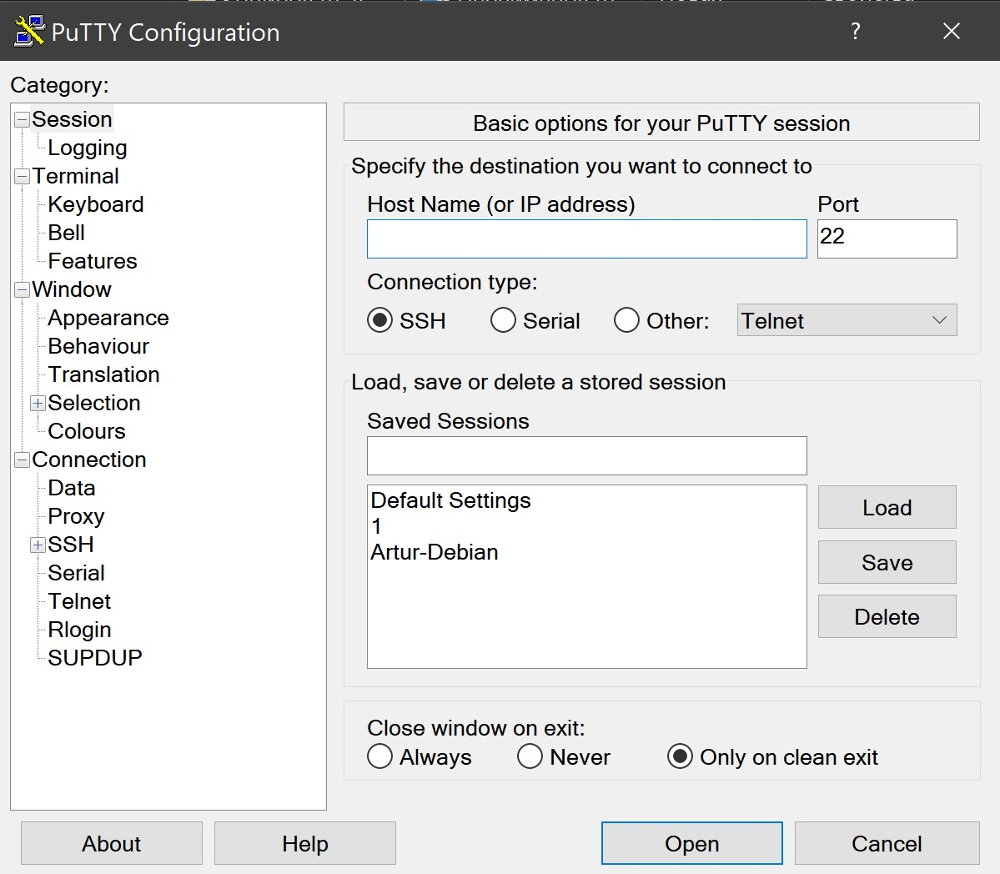

# Домашняя работа № 01
-------------------------------
## Урок 1. Основы компьютерных сетей. Технология Ethernet. Часть 1.

> [Файл .pkt:](SmirnovAV_lesson_01.pkt)

- ### 1. Скачать и установить cisco packet tracer 7.0:

    Скачать его после регистрации по ссылке:
    [Packet Tracer](https://www.netacad.com/ru/about-networking-academy/packet-tracer/ "netacad.com") 
    После регистрации на сайте вы можете найти ссылку на скачивание в разделе.
    Exploratory \ Pages \ Download \ Packet Tracer
-------------------------------
- ### 2. Диагностика физического уровня:

    Скачать файл **packet tracer**, в котором собрана сеть с несколькими хостами (в центре хаб, а также пара компьютер – компьютер), в каждом из которых проблема с линком.  ***Задача:*** поднять все линки и проверить связь командой **ping**.
-------------------------------
- ### 3. Скачать и установить putty:

    [PUTTY](http://www.putty.org/ "понадобится в дальшнейшем")
    
    

-------------------------------
- ### 4. Скачать и установить wireshark:

    [WIRESHARK](https://www.wireshark.org/download.html "wireshark")
    
    ***Примечание:*** будет предложено установить драйвер **pcap** – это необходимо сделать, иначе **wireshark** не получит доступ к канальному уровню ОС.
    
    
    
-------------------------------
- ### 5. Попробовать команды **tracert / ping / ipconfig** на домашнем компьютере.

     
     
     

-------------------------------
- ### 6. Попробовать команды *(по желанию)* **hostname / arp** и разобраться с выводом.

-------------------------------
- ### 7. Посмотреть ролик про историю Интернета *(по желанию)*:

    [История интернета](https://www.youtube.com/watch?v=MbMAPoga8tE "Youtube")

-------------------------------
- ### 8. Определить и записать физическую топологию сетей:

    ***Примечание:*** смотрите рисунок в методичке.

     
