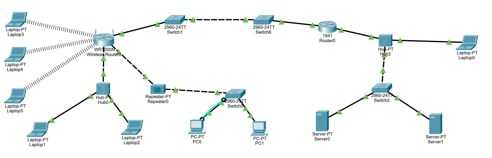
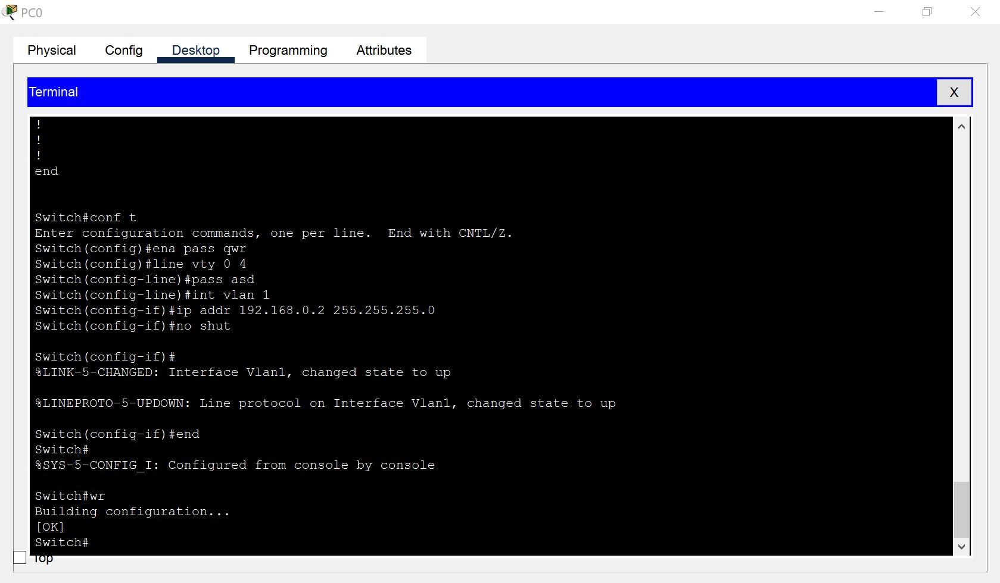
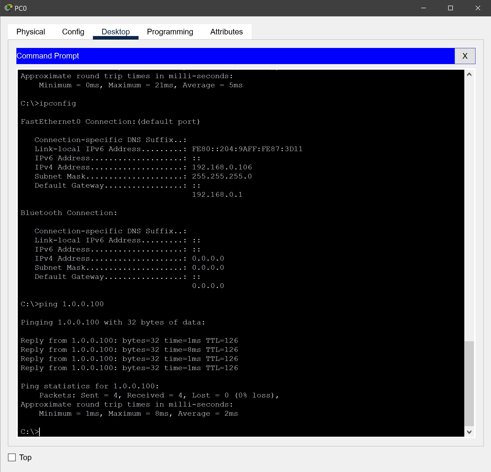
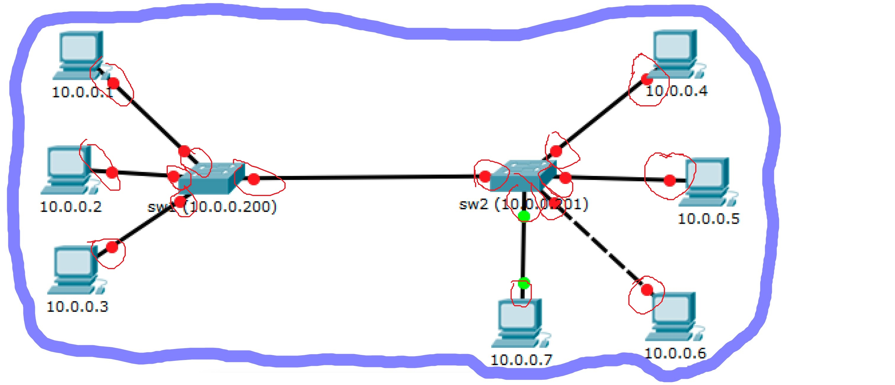

# Домашняя работа № 02
-------------------------------
## Урок 2. Физический и канальный уровень. Технология Ethernet. Часть 2

> [Файл .pkt](SmirnovAV_lesson_02.pkt)

- ### 1. Исправить проблемы с линками на всех хостах.

    
-------------------------------
- ### 2. Настроить сетевые интерфейсы на всех хостах и менеджмент на свитчах, используя только консольный кабель.

     
    
-------------------------------
- ### 3. Обвести синим цветом все широковещательные домены, а красным все домены коллизий.
    *(см. картинку в методичке)*
    
    
