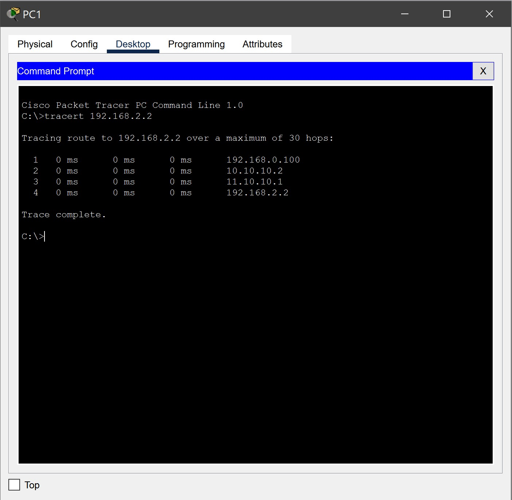

# Домашняя работа № 03
-------------------------------
## Урок 3. Сетевой уровень. Часть 1

> [Файл .pkt](SmirnovAV_lesson_03.pkt)

- ### 1. В приложенном файле в Cisco Packet Tracer связать файлы с помощью статической маршрутизации.
    
-------------------------------
- ### 2. Проследить в Cisco Packet Tracer, Wireshark работу протоколов arp, icmp (например, используя tracert или traceroute -I).

    
