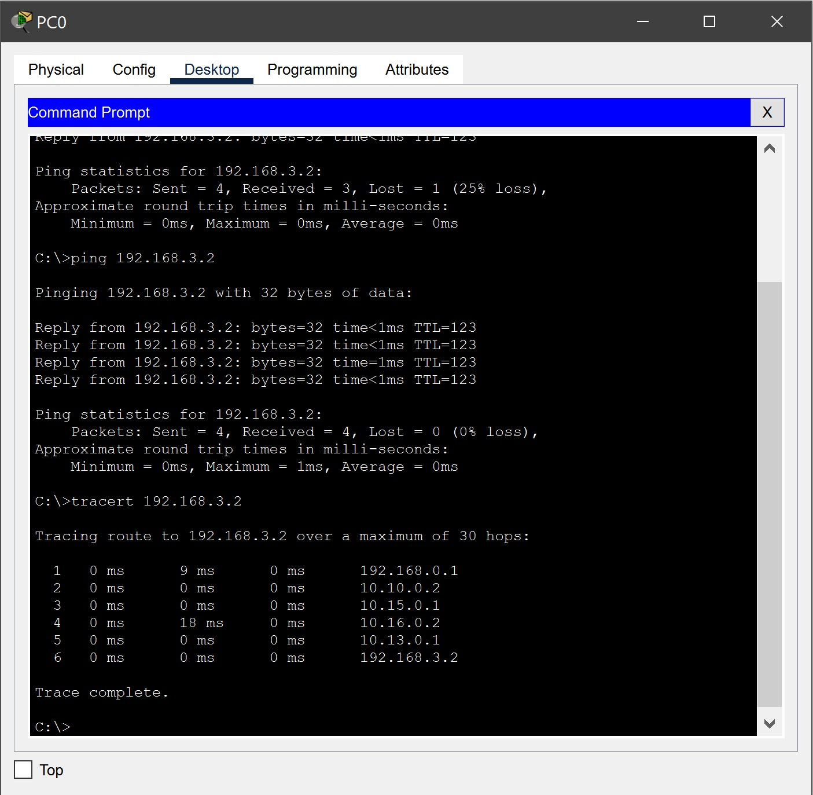

# Домашняя работа № 04
-------------------------------
## Урок 4. Сетевой уровень. Часть 2

> [Файл .pkt](SmirnovAV_lesson_04.pkt)

- ### 1. На всех маршрутизаторах настроить динамическую маршрутизацию с помощью протокола RIP2 и DHCP сервер для динамической настройки клиентов в LAN.

    
