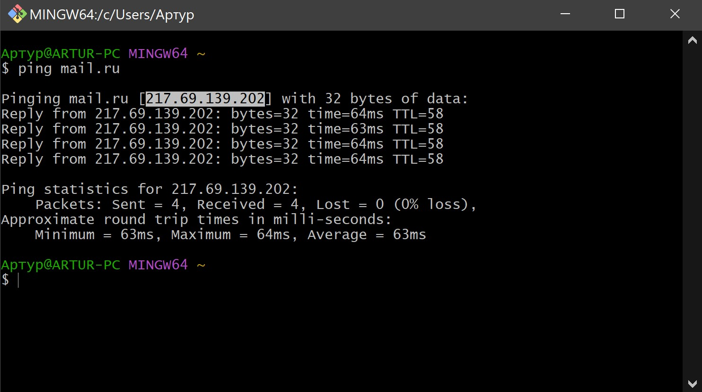
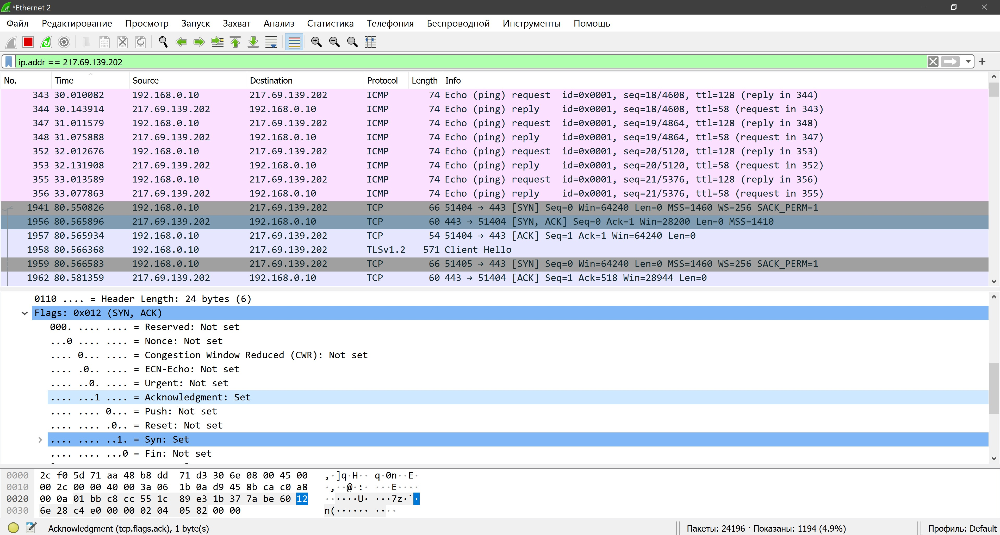
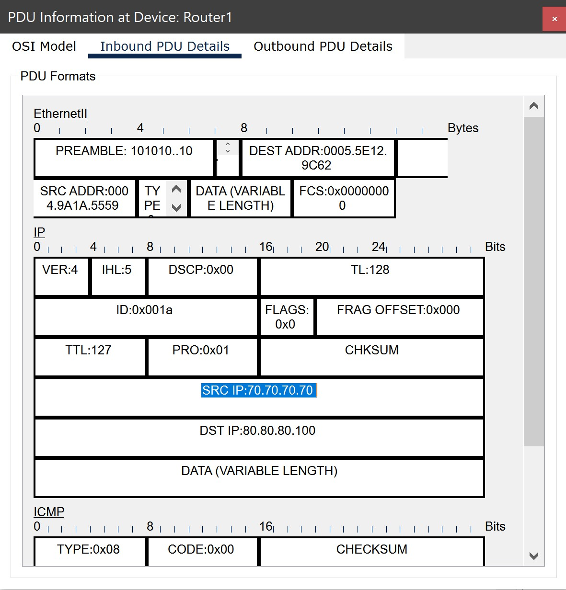

# Домашняя работа № 05
-------------------------------
## Урок 5. Транспортный уровень

> [Файл .pkt](SmirnovAV_lesson_05.pkt)

- ### 1. Работа в Wireshark.

    Запустить Wireshark, выбрать любой веб-сайт, определить IP-адрес сервера, отфильтровать в Wireshark трафик по этому IP-адресу. Набрать адрес сервера в строке браузера. Сколько TCP-соединений было открыто и почему. В работе можно использовать источник 1 из списка дополнительных материалов.

    
    
    
-------------------------------
- ### 2. Настроить перегруженный NAT в предложенной схеме в Cisco Packet Tracer.

    С помощью режима симуляции удостовериться, что при подключении на веб-сервер происходит подмена IP-адресов и портов. Посмотреть таблицу трансляции NAT на маршрутизаторе.
    
    
