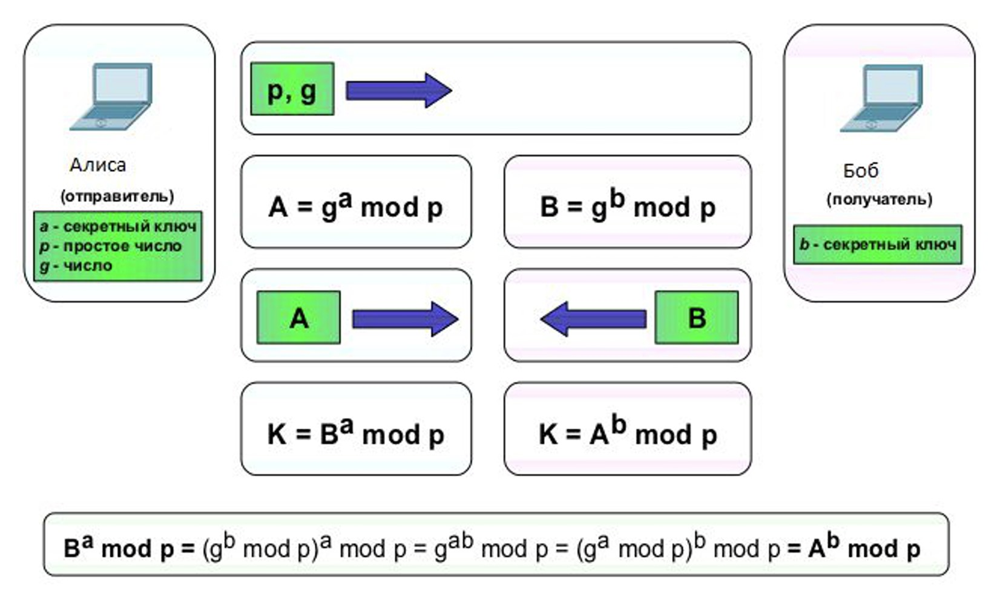
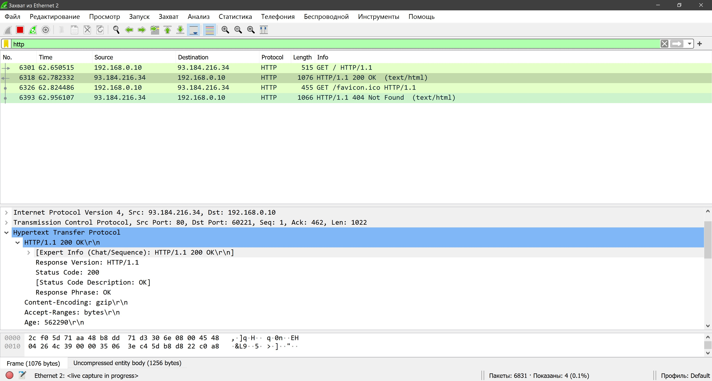
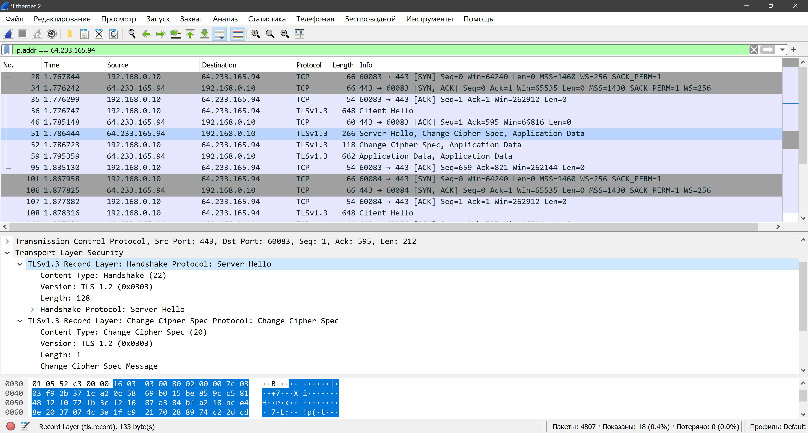
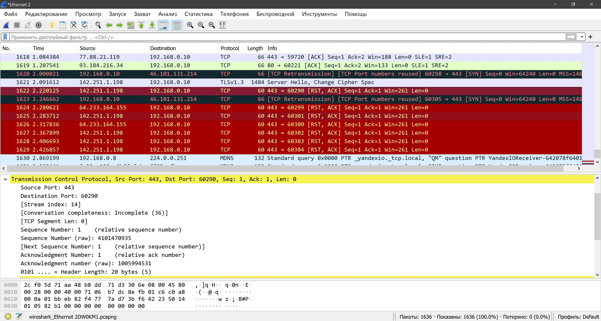
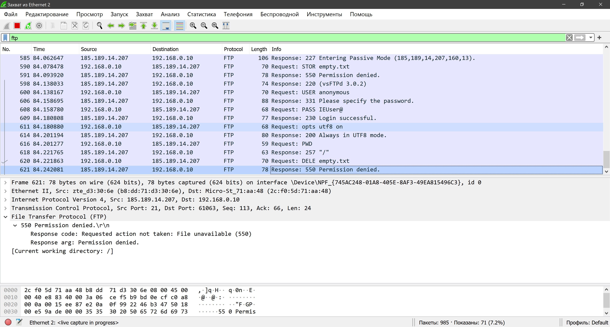

# Домашняя работа № 06
-------------------------------
## Урок 6. Углубленное изучение сетевых технологий. Часть 1

- ### 1. Алгоритм Диффи-Хелмана.

    ***Ответ:*** Отправитель передает 2 числа получателю, затем шифрует свой ключ этими числами и передает шифрованный ключ получателю. В свою очередь получатель шифрует принятыми числами свой ключ и передает отправителю. Таким образом происходит шифрованный обмен ключами. Каждый из них дешифрует ключ по указанной ниже формуле. 
    ***Примечание*** Если числа **p,g** передавать по альтернативному каналу, то данная схема будет надежнее.

    
    
-------------------------------
- ### 2. С помощью Wireshark или Cisco Packet Tracer отследить трафик, идущий по протоколу HTTP и HTTPS. В чем разница? Попробовать отследить трафик в Wireshark, подключаясь к сервисам Google (например, youtube.com) с помощью браузера Google Chrome. Какой протокол используется для доступа к веб-сервисам?

    ***Ответ:*** Обращение идет по порту 80 без шифрования.
    
    
    
    ***Ответ:*** Обращение идет по порту 443 с шифрованием TLS.
    
    
    
    ***Ответ:*** Обращение идет по порту 443 протокол HTTPS, на компьютере выделяется сразу несколько портов для приема данных.
    
    

-------------------------------
- ### 3. С помощью Wireshark отследить трафик при работе с обычным ftp (найти любой ftp-ресурс и подключиться к нему, через браузер). Можно ли через ftp передавать данные на сервер, как предлагают некоторые хостеры?

    ***Ответ:*** Передавать данные на серевер можно при наличии соответствующих прав доступа.

    