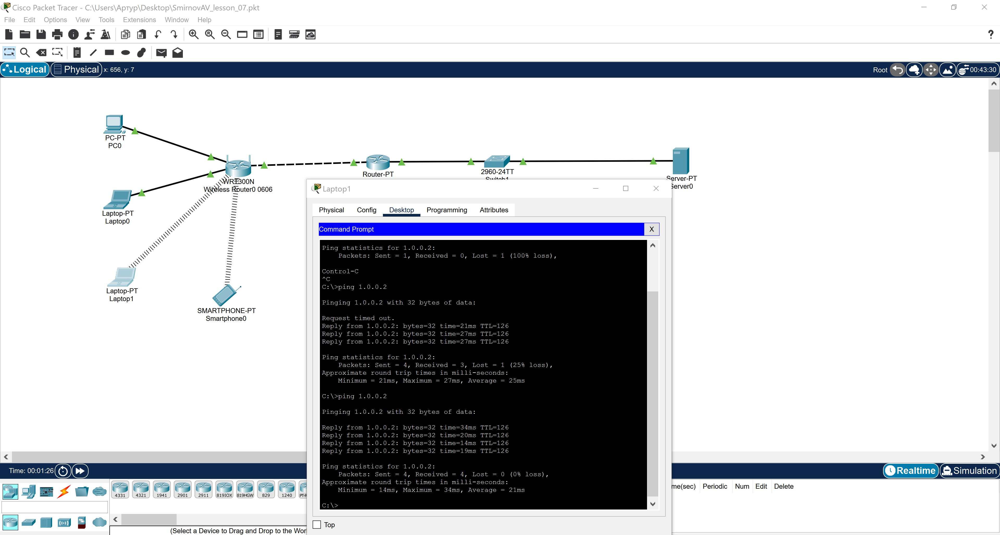

# Домашняя работа № 07
-------------------------------
## Урок 7. Углубленное изучение сетевых технологий. Часть 2

> [Файл .pkt](SmirnovAV_lesson_07.pkt)

- ### 1. Исправить проблемы с линками (настроить IP-адреса, там, где они не настроены).
-------------------------------
- ### 2. Поднять Wi-Fi (нужно посмотреть, что не так с беспроводным роутером).
-------------------------------
- ### 3. Убедиться, что все хосты получили адреса по DHCP.
-------------------------------
- ### 4. Убедиться, что сервер доступен (с помощью команды ping).

    
