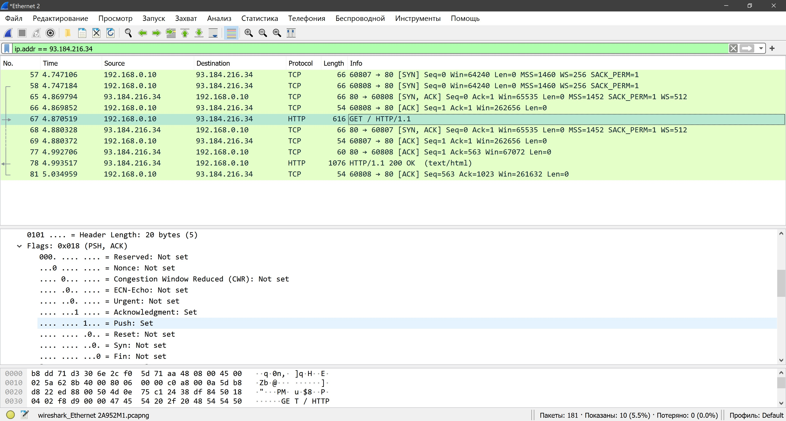

# Домашняя работа № 08
-------------------------------
## Урок 8. Прикладной уровень

- ### 1. Подключиться с помощью браузера к ресурсу, поддерживающему **http**, и в Wireshark или CharlesProxy проанализировать заголовки. Сколько **TCP**-сессий формирует браузер. Почему и для чего?

    ***Ответ:*** 
    58 - запрос синхронизации с сервером 
    65 - ответ от серевера и встречный запрос 
    66 - ответ от ПК 
    67 - GET запрос 
    77 - ответ, что запрос принят 
    78 - отправка данных страницы 
    81 - ответ, что данные приняты

    
